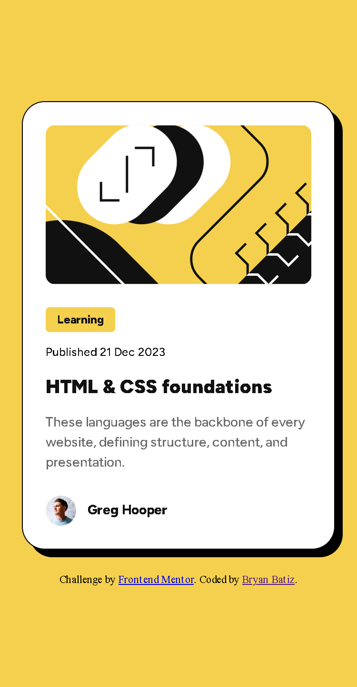

# Frontend Mentor - Blog preview card solution

This is a solution to the [Blog preview card challenge on Frontend Mentor](https://www.frontendmentor.io/challenges/blog-preview-card-ckPaj01IcS). Frontend Mentor challenges help you improve your coding skills by building realistic projects. 

## Table of contents

- [Overview](#overview)
  - [The challenge](#the-challenge)
  - [Screenshot](#screenshot)
  - [Links](#links)
- [My process](#my-process)
  - [Built with](#built-with)
  - [What I learned](#what-i-learned)
  - [Continued development](#continued-development)
  - [Useful resources](#useful-resources)
- [Author](#author)

## Overview

### The challenge

Users should be able to:

- See hover and focus states for all interactive elements on the page

### Screenshot



### Links

- Solution URL: [https://www.frontendmentor.io/solutions/blog-preview-card-using-scss-flexbox-and-custom-mixins-Rinzet](https://www.frontendmentor.io/solutions/blog-preview-card-using-scss-flexbox-and-custom-mixins-Rinzet)
- Live Site URL: [https://rinzet.github.io/blog-preview-card/](https://rinzet.github.io/blog-preview-card/)

## My process

### Built with

- Semantic HTML5 markup
- SCSS with custom mixins
- Flexbox
- CSS `clamp()` for responsive typography
- Mobile-first workflow

### What I learned

This project helped me strengthen my understanding of SCSS structure and the use of reusable mixins, especially for typography. I also gained a better understanding of how `padding`, `margin`, and `gap` work in flex containers.

One of the key things I practiced was using `clamp()` to create responsive font sizes without relying on media queries:

```scss
@mixin typo-font($font-weight, $font-size, $font-color) {
  font-family: 'Figtree', sans-serif;
  font-weight: $font-weight;
  font-size: clamp(14px, 4vw, $font-size);
  color: $font-color;
  line-height: 150%;
  letter-spacing: 0;
}
```

### Continued development

In future projects, I want to continue focusing on:

- Mastering CSS Grid for layout design
- Improving accessibility (ARIA roles, better semantics)
- Creating smooth transitions and micro-interactions

### Useful resources

- [MDN Web Docs - clamp()](https://developer.mozilla.org/en-US/docs/Web/CSS/clamp) - Great explanation and examples of how `clamp()` works.
- [Kevin Powell (YouTube)](https://www.youtube.com/c/KevinPowell) - Helped me understand SCSS best practices and responsive design.
- [CSS-Tricks Flexbox Guide](https://css-tricks.com/snippets/css/a-guide-to-flexbox/) - My go-to reference for Flexbox.

## Author

- Frontend Mentor - [@Rinzet](https://www.frontendmentor.io/profile/Rinzet)